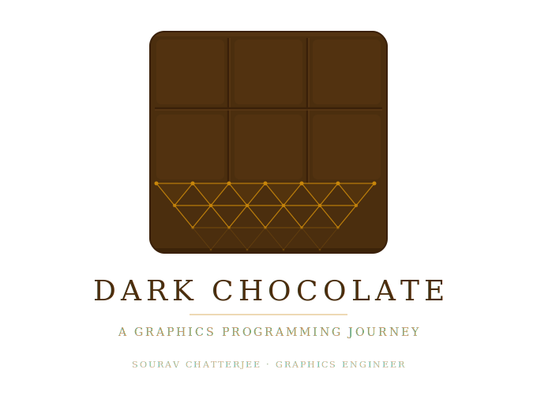

<p align="center">
  
</p>
 
<p align="center">
  <a href="#"></a>
  <a href="#"></a>
  <a href="#"></a>
  <a href="#"></a>
</p>
 
---

## What Is This?

Dark Chocolate is a real-time graphics engine that implements five GPU backends behind a single abstraction layer. The engine is built incrementally — each part introduces a new subsystem or backend, with tests written alongside the code, not bolted on afterward.

By the end of Phase 1, the engine will have a working OpenGL, DX11, DX12, Vulkan, and Metal renderer, a scene graph with ECS, a cross-platform shader pipeline, compute shader support, and an editor shell powered by Dear ImGui — all enforcing strict architectural separation between engine logic and GPU platform code.

**Author:** Sourav Chatterjee · Graphics Engineer

---

## Architecture

```
main() / EntryPoint.cpp
└── Application (main loop · owns LayerStack · owns IRenderBackend)
    ├── LayerStack
    │   ├── EditorLayer (#ifdef DC_BUILD_EDITOR)
    │   └── RuntimeLayer (play mode · shipped builds)
    └── RenderCommand (static facade)
        ──── << THE WALL >> ────
        ├─ OpenGLBackend
        ├─ DX11Backend
        ├─ DX12Backend
        ├─ VulkanBackend
        └─ MetalBackend
```

**The Wall** is the engine's core architectural invariant: nothing above `IRenderBackend` ever includes a platform GPU header. No `<d3d12.h>`, no `<vulkan/vulkan.h>`, no `<Metal/Metal.h>` above `src/Renderer/Backends/`. No exceptions.

### Invariants

These rules apply to every file in the repository, no exceptions:

- **`namespace DC{}`** — all engine code lives here. (Except `.mm` files — no `namespace DC` in Objective-C++ sources.)
- **`Result<T,E>`** — all fallible functions return this. No `std::optional` for errors, no error codes, no exceptions for control flow. `[[nodiscard]]` on every `Init()`, `Load()`, and `Create()`.
- **Five backends** — every feature ships on all five. If hardware support is optional, there's a fallback path.

---

## Backends

| Backend | Platform | CI Strategy |
|---------|----------|-------------|
| OpenGL 4.5 | Windows · macOS · Linux | Mesa llvmpipe (software rasterizer) |
| DirectX 11 | Windows | WARP (software rasterizer) |
| DirectX 12 | Windows | WARP (software rasterizer) |
| Vulkan 1.2 | Windows · Linux (macOS via MoltenVK) | — |
| Metal 2/3/4 | macOS | — |

Platform defaults: **Windows → DX12**, **macOS → Metal**, **Linux → Vulkan**. DX11 and OpenGL available as command-line fallbacks.

---

## Phase 1 Roadmap

Phase 1 builds the engine from an empty skeleton to a full five-backend renderer with scene graph, shader pipeline, compute shaders, and an editor shell. Target: **273 tests**.

### Project Skeleton
 
| Deliverable | Status |
|-------------|--------|
| Directory structure, root `CMakeLists.txt`, `CMakePresets.json` | ✅ |
| All five backend targets compile with empty `Init()` stubs | ⬜ |
| GLFW window creation on all three platforms | ⬜ |

### Engine Core

| Deliverable | Status |
|-------------|--------|
| `Application` singleton, main loop, `LayerStack` push/pop | ⬜ |
| `IRenderBackend` interface with factory (`Create(BackendType)`) | ⬜ |
| `RenderCommand` static facade | ⬜ |
| `Log` (spdlog), `Window` (GLFW), `FrameTimer` | ⬜ |
| `Scene`, `Entity`, `TransformComponent` (initial ECS shell) | ⬜ |
| `EditorLayer` with Dear ImGui docking | ⬜ |
| GitHub Actions CI — Linux (ubuntu-24.04) + Windows (windows-2022) | ⬜ |
| Catch2 test harness with `test_listener.cpp` | ⬜ |

### OpenGL Backend

| Deliverable | Status |
|-------------|--------|
| `OpenGLBackend` implements `IRenderBackend` (GLAD loader) | ⬜ |
| Triangle rendering with vertex/index buffers | ⬜ |
| Integration tests via Mesa llvmpipe + `xvfb-run` on CI | ⬜ |

### DirectX 11 Backend

| Deliverable | Status |
|-------------|--------|
| `DX11Backend` — COM device/context, swap chain, input layout | ⬜ |
| `DX11Buffer`, `DX11Shader`, `DX11InputLayout` | ⬜ |
| WARP software rasterizer integration tests on CI | ⬜ |

### DirectX 12 Backend

| Deliverable | Status |
|-------------|--------|
| `DX12Backend` — command queues, descriptor heaps, PSOs, root signatures | ⬜ |
| `DX12Device`, `DX12CommandQueue`, `DX12DescriptorHeap`, `DX12FrameResources` | ⬜ |
| N-frames-in-flight with fence-based synchronization | ⬜ |
| WARP integration tests on CI | ⬜ |

### Vulkan Backend

| Deliverable | Status |
|-------------|--------|
| `VulkanInstance`, `VulkanDevice`, `VulkanSurface`, `VulkanSwapChain` | ⬜ |
| `VulkanAllocator` (VMA integration) | ⬜ |
| Render pass, pipeline, synchronization (fences + semaphores) | ⬜ |
| MoltenVK support on macOS | ⬜ |

### Metal Backend

| Deliverable | Status |
|-------------|--------|
| `MetalBackend` — TBDR/UMA model, Obj-C++ bridge, pImpl firewall | ⬜ |
| `MetalDevice`, `MetalCommandQueue`, `MetalCommandBuffer`, `MetalPipeline` | ⬜ |
| Argument buffers (Tier 2), indirect command buffers | ⬜ |
| Metal 4 path — `MTL4CommandBuffer`, `MTL4ArgumentTable`, `MTL4Compiler` | ⬜ |
| Dual guards: compile-time `#if defined(__MAC_26_0)` + runtime `@available(macOS 26.0, *)` | ⬜ |

### Scene Graph + Asset Pipeline

| Deliverable | Status |
|-------------|--------|
| Scene graph with ECS, dirty flags, spatial acceleration | ⬜ |
| `AssetManager` with GUID-based references, glTF/FBX import (Assimp) | ⬜ |
| Edit/play mode separation | ⬜ |

### Shader System

| Deliverable | Status |
|-------------|--------|
| `.dcshader` format + recursive descent parser (`DCShaderParser`) | ⬜ |
| `ShaderCompilerPipeline`: GLSL → glslang → SPIR-V → SPIRV-Cross → HLSL/GLSL/MSL | ⬜ |
| `PermutationDatabase`, `ShaderStripper`, `ShaderWarmup` | ⬜ |
| `SPIRVReflector` — uniform/texture binding extraction | ⬜ |
| Multi-backend link audit (ODR violation diagnosis) | ⬜ |

### Scene Implementation + GPU Upload

| Deliverable | Status |
|-------------|--------|
| `CameraComponent`, `LightComponent`, `MeshRendererComponent` | ⬜ |
| Gribb-Hartmann frustum culling | ⬜ |
| `SceneRenderer` — GPU upload across all five backends | ⬜ |
| `GPUResourceCache`, `Material` system, `Uniforms` | ⬜ |

### Compute Shaders

| Deliverable | Status |
|-------------|--------|
| `.dccompute` format + parser | ⬜ |
| `IComputePipeline` interface | ⬜ |
| `IGPURWBuffer` (read-write GPU buffers) | ⬜ |
| Compute implementations for all five backends | ⬜ |

### Architecture Finale

| Deliverable | Status |
|-------------|--------|
| `Result<T,E>` with `Map()`, `AndThen()`, `ValueOr()` across all subsystems | ⬜ |
| `RenderGraph` stub (interface contract for Phase 2 FrameGraph) | ⬜ |
| Backend parity enforcement — reference scene rendered on all backends, pixel-compared | ⬜ |
| Canonical startup/shutdown sequence | ⬜ |
| `BackendParity.h` + `RendererCapabilities` | ⬜ |
| **273 tests passing across all backends** | ⬜ |

---

## Project Structure (End of Phase 1)

```
DarkChocolate/
├── CMakeLists.txt                  # Root: FetchContent for all deps, C++20
├── CMakePresets.json               # windows-vs, macos-debug, linux-ci
├── .github/workflows/ci.yml       # Unit + integration tests (Mesa, WARP)
│
├── src/
│   ├── CMakeLists.txt              # DarkChocolateCore static lib + executable
│   ├── main.cpp
│   │
│   ├── Core/
│   │   ├── Application.h / .cpp
│   │   ├── Engine.h / .cpp
│   │   ├── EntryPoint.cpp
│   │   ├── FrameTimer.h
│   │   ├── Layer.h
│   │   ├── LayerStack.h / .cpp
│   │   ├── Log.h / .cpp
│   │   ├── Result.h
│   │   ├── ScopedBind.h
│   │   ├── DCThread.h
│   │   └── Window.h / .cpp
│   │
│   ├── Platform/
│   │   ├── IWindow.h
│   │   └── Metal/
│   │       ├── MetalWindow.h
│   │       └── MetalWindow.mm
│   │
│   ├── Renderer/
│   │   ├── IRenderBackend.h / .cpp     # ← THE WALL
│   │   ├── RenderCommand.h / .cpp
│   │   ├── RenderGraph.h / .cpp        # Stub — implemented in Phase 2
│   │   ├── SceneRenderer.h / .cpp
│   │   ├── RendererCapabilities.h
│   │   ├── BackendParity.h
│   │   ├── PipelineDesc.h
│   │   ├── Uniforms.h
│   │   ├── IComputePipeline.h
│   │   ├── IGPUBuffer.h
│   │   ├── IGPURWBuffer.h
│   │   ├── IGPUShader.h
│   │   ├── IGPUTexture.h
│   │   │
│   │   └── Backends/
│   │       ├── OpenGL/                 
│   │       ├── DX11/                   
│   │       ├── DX12/                   
│   │       ├── Vulkan/                 
│   │       └── Metal/                  
│   │
│   ├── Shader/
│   │   ├── DCShaderTypes.h
│   │   ├── DCShaderParser.h / .cpp
│   │   ├── DCComputeParser.h
│   │   ├── DCComputeTypes.h
│   │   ├── IShaderCompiler.h
│   │   ├── SPIRVCompiler.h / .cpp
│   │   ├── GLSLCompiler.h
│   │   ├── MSLCompiler.h
│   │   ├── HLSLCompiler.h
│   │   ├── ShaderCompilerPipeline.h / .cpp
│   │   ├── ComputeCompilerPipeline.h / .cpp
│   │   ├── SPIRVReflector.h / .cpp
│   │   ├── PermutationDatabase.h
│   │   ├── ShaderStripper.h
│   │   ├── ShaderWarmup.h
│   │   ├── InUseTracker.h
│   │   └── RuntimeShader.h
│   │
│   ├── Scene/
│   │   ├── Scene.h / .cpp
│   │   ├── Entity.h
│   │   ├── Components.h
│   │   ├── TransformComponent.h
│   │   ├── CameraComponent.h
│   │   ├── LightComponent.h
│   │   ├── MeshRendererComponent.h
│   │   ├── Material.h / .cpp
│   │   └── Frustum.h
│   │
│   └── Editor/
│       ├── EditorLayer.h / .cpp
│       └── EditorApp.cpp
│
├── assets/shaders/
│   ├── Lit.dcshader
│   ├── Unlit.dcshader
│   ├── triangle.vert
│   └── triangle.frag
│
└── tests/
    ├── CMakeLists.txt
    ├── test_listener.cpp
    ├── test_log.cpp
    ├── test_window.cpp
    ├── test_layerstack.cpp
    ├── test_rendercommand.cpp
    ├── test_application.cpp
    ├── test_entity.cpp
    ├── test_scene.cpp
    ├── test_transform.cpp
    ├── test_editormode.cpp
    ├── test_opengl_unit.cpp
    ├── test_dx11_unit.cpp
    ├── test_dx12_unit.cpp
    ├── test_vulkan_unit.cpp
    ├── test_vulkan_backend_unit.cpp
    ├── test_capabilities.cpp
    ├── test_shader_parser.cpp
    ├── test_shader_pipeline.cpp
    ├── test_spirv_compiler.cpp
    ├── test_glsl_compiler.cpp
    ├── test_msl_compiler.cpp
    ├── test_hot_reload.cpp
    ├── test_parity.cpp
    ├── test_render_graph.cpp
    ├── test_result.cpp
    ├── test_startup.cpp
    ├── test_shaders/
    │   ├── unlit.dcshader
    │   └── invalid.dcshader
    └── integration/
        ├── opengl/
        ├── dx11/
        ├── dx12/
        └── vulkan/
```

---

## Dependencies

All fetched automatically via CMake `FetchContent`. No manual downloads.

| Dependency | Purpose |
|------------|---------|
| [GLFW](https://github.com/glfw/glfw) | Window creation + input |
| [GLM](https://github.com/g-truc/glm) | Math (column-major matrices, quaternions) |
| [Dear ImGui](https://github.com/ocornut/imgui) (docking branch) | Editor UI |
| [Catch2 v3](https://github.com/catchorg/Catch2) | Testing |
| [spdlog](https://github.com/gabime/spdlog) | Logging |
| [Assimp](https://github.com/assimp/assimp) | Asset import (glTF, FBX) |
| [stb](https://github.com/nothings/stb) | Image loading (stb_image) |
| [glslang](https://github.com/KhronosGroup/glslang) | GLSL/HLSL → SPIR-V |
| [SPIRV-Cross](https://github.com/KhronosGroup/SPIRV-Cross) | SPIR-V → GLSL/HLSL/MSL |
| [VMA](https://github.com/GPUOpen-LibrariesAndSDKs/VulkanMemoryAllocator) | Vulkan memory allocation |
| [D3D12MA](https://github.com/GPUOpen-LibrariesAndSDKs/D3D12MemoryAllocator) | DX12 memory allocation |

**Platform SDKs (not fetched):** Vulkan SDK (LunarG), Windows SDK (for DX11/DX12), Xcode + Metal SDK (macOS).

---

## Building

### Prerequisites

- **CMake 4.2+** (Ninja required on Linux; Windows and macOS use IDE generators)
- **C++20 compiler:** MSVC 2026+ (Visual Studio 18), Clang 15+, or GCC 13+
- **Platform SDK** for your target backend(s)

### Quick Start

```bash
git clone <repo-url>
cd dark-chocolate

# Pick your preset
cmake --preset windows-vs         # Windows (Visual Studio 18 2026, x64)
cmake --preset macos-debug        # macOS (Xcode)
cmake --preset linux-ci           # Linux (Ninja, Release)

cmake --build --preset windows-debug    # Debug build
cmake --build --preset windows-release  # Release build
cmake --build --preset macos-debug
cmake --build --preset linux-ci
```

### Running Tests

```bash
cd build/<preset>
ctest -C Debug --output-on-failure     # or -C Release
```

Integration tests need a GPU or software fallback:

- **OpenGL:** `LIBGL_ALWAYS_SOFTWARE=1` + `MESA_GL_VERSION_OVERRIDE=4.1` + `xvfb-run -a`
- **DX11 / DX12:** WARP (built into Windows — no setup required)

---

## CI

GitHub Actions on every push to `main` and `develop`:

- **Unit tests** — Linux + Windows, Debug + Release
- **Integration tests** — OpenGL via Mesa llvmpipe, DX11 via WARP, DX12 via WARP
- **All-pass gate** — merge blocked unless every job succeeds
- Concurrency groups cancel stale in-progress runs on the same PR

---

## Conventions

| What | Rule |
|------|------|
| Naming | `m_PascalCase` members, `I`-prefix interfaces, `s_PascalCase` statics, `DC_` macros |
| Error handling | `Result<T,E>` + `[[nodiscard]]` on every fallible function |
| Tests | Catch2, `test_snake_case.cpp`, Arrange-Act-Assert |
| Shaders | `.dcshader` (raster), `.dccompute` (compute). GLSL source → SPIR-V → cross-compile |
| Metal files | No `namespace DC` in `.mm` files. Metal 4 uses dual guards (compile-time + runtime) |
| Warnings | `/W4 /WX` (MSVC), `-Wall -Wextra -Werror` (GCC/Clang). Per-target, no globals. |

---

## What Comes After Phase 1

Phase 1 delivers the engine foundation — five backends, shader pipeline, scene graph, compute, and editor shell. Future phases build on top of this without ever breaking The Wall:

- **Phase 2** — FrameGraph, job system, PBR, GPU memory management, material graph, texture streaming, GPU-driven rendering
- **Phase 3** — TAA, deferred/clustered lighting, global illumination, ray tracing, virtual geometry, atmosphere, animation, VFX, terrain, physics, GPU profiler, low-level optimization

---

## License

Proprietary. All rights reserved.

**© Sourav Chatterjee · Graphics Engineer**
